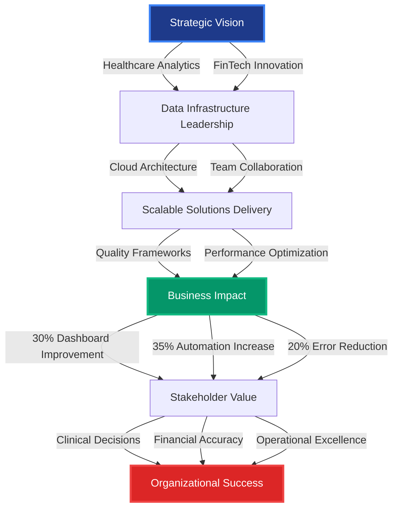
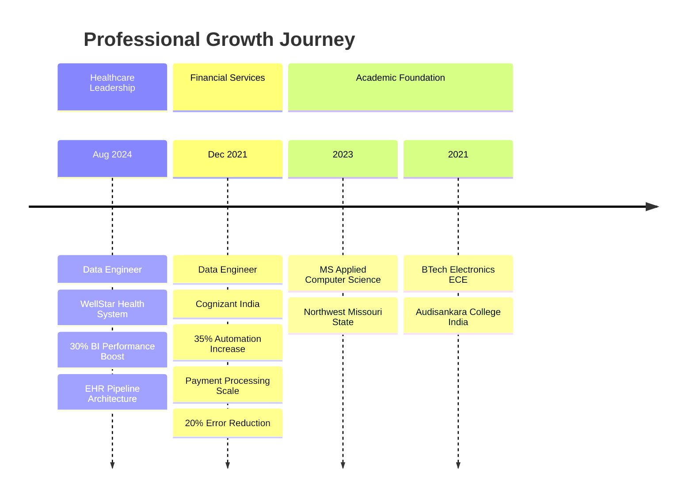
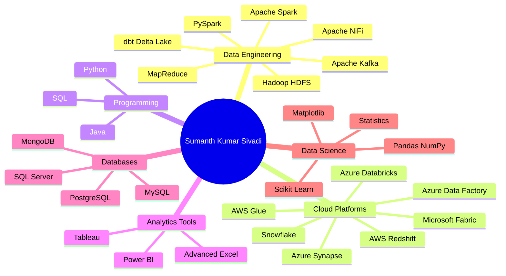

  

  
  ### 🎯 Strategic Data Engineering Leader | Driving Business Value Through Scalable Analytics Solutions
  
  
  [%20252--6919-25D366?style=for-the-badge&logo=whatsapp&logoColor=white)](tel:4702526919)
  
  

---

## 📊 EXECUTIVE PERFORMANCE DASHBOARD

| **Leadership Metric** | **Impact Delivered** | **Strategic Value** |
|:---:|:---:|:---:|
| **🏥 Healthcare Data Transformation** | **30% Performance Improvement** | Power BI optimization driving clinical decisions |
| **💰 Financial Services Excellence** | **35% Automation Increase** | Real-time payment processing at scale |
| **📉 Data Quality Enhancement** | **20% Error Reduction** | Mission-critical healthcare EHR validation |
| **⚡ Process Optimization** | **15% Consistency Improvement** | Enterprise-grade MongoDB implementation |
| **🎓 Advanced Education** | **MS Computer Science** | Cross-disciplinary innovation (ECE → CS) |
| **🔧 Technical Leadership** | **2.5+ Years Enterprise Experience** | Fortune 500 & Healthcare Systems |

---

## 💼 EXECUTIVE SUMMARY

**Strategic data engineering professional** with proven track record of delivering **high-impact analytics solutions** across **healthcare and financial services** sectors. Currently driving **critical data infrastructure initiatives** at **WellStar Health System**, one of Georgia's largest healthcare providers, while leveraging **2.5+ years of enterprise experience** from **Cognizant** serving Fortune 500 financial institutions.

**Core Leadership Competencies:**
- ✅ **Healthcare Analytics Transformation**: Architecting scalable EHR data pipelines processing millions of patient encounters
- ✅ **Financial Services Innovation**: Delivered 35% automation improvement in payment processing workflows
- ✅ **Cloud Architecture Excellence**: Multi-cloud expertise (AWS, Azure, Snowflake) driving cost-effective solutions
- ✅ **Data Quality Leadership**: Reduced critical data errors by 20% through robust validation frameworks
- ✅ **Cross-Functional Collaboration**: Bridging clinical operations, finance, and technology stakeholders

**Strategic Differentiator**: Unique combination of **electronics engineering foundation** (Bachelor's in ECE) and **advanced computer science expertise** (Master's in Applied CS from Northwest Missouri State University), enabling **systems-thinking approach** to complex data challenges.

---

## 🎯 LEADERSHIP PHILOSOPHY

> *"Transforming complex healthcare and financial data into strategic assets through scalable engineering, cross-functional collaboration, and relentless focus on business outcomes. I believe in building data infrastructure that not only solves today's challenges but anticipates tomorrow's opportunities."*

**My Leadership Approach:**
- **Business-First Mindset**: Every pipeline, every optimization, every data model must drive measurable business value
- **Quality as Foundation**: 20% error reduction isn't just a metric—it's patient safety and financial accuracy
- **Scalability by Design**: Building systems that grow with organizational needs, from thousands to millions of records
- **Stakeholder Empowerment**: Delivering self-service analytics that enable clinical and business leaders to make data-driven decisions
- **Continuous Innovation**: Staying ahead of industry trends (Delta Lake, dbt, Microsoft Fabric) to maintain competitive advantage

---

## 🚀 STRATEGIC IMPACT ARCHITECTURE

---

## 📈 CAREER PROGRESSION TIMELINE

---

## 🏆 KEY STRATEGIC ACHIEVEMENTS

### 🏥 **Healthcare Data Transformation (WellStar Health System)**

**Initiative**: Enterprise-scale EHR analytics infrastructure for Georgia's premier healthcare network

**Leadership Actions:**
- Architected **Python and SQL-based ETL workflows** processing **millions of patient encounters**, claims, and clinical events daily
- Implemented **Apache Spark (PySpark) and Azure Data Factory** pipelines, reducing manual intervention and improving reliability
- Designed **Star and fact-dimension schemas** in Snowflake and Azure Synapse for clinical operations and financial reporting
- Led **Power BI optimization initiative** achieving **30% performance improvement** in critical dashboards used by clinical leadership

**Business Impact:**
- **📊 30% faster clinical decision-making** through optimized Power BI dashboards
- **🎯 15% improvement in data consistency** via Azure Databricks validation frameworks
- **⚡ Real-time clinical insights** enabling proactive patient care management
- **💰 Cost optimization** through efficient cloud resource utilization (Azure ecosystem)

**Technical Innovation:**
- Implemented **schema evolution handling** for dynamic EHR data structures
- Deployed **partitioning strategies** for petabyte-scale healthcare datasets
- Built **data quality reconciliation logic** detecting duplicate/missing patient records
- Leveraged **MapReduce** for batch processing of unstructured clinical logs

---

### 💳 **Financial Services Excellence (Cognizant)**

**Initiative**: Payment processing analytics platform for Fortune 500 banking clients

**Leadership Actions:**
- Developed **Tableau dashboards** visualizing payment authorizations, fraud alerts, and regulatory compliance metrics
- Built **PySpark and AWS Glue pipelines** automating batch and near-real-time data ingestion, achieving **35% reduction in manual intervention**
- Architected **MongoDB collections** for semi-structured transaction metadata, enabling flexible schema evolution
- Processed **high-volume banking transactions** using Hadoop HDFS, supporting millions of daily records
- Implemented **Apache NiFi monitoring** with proactive alerting, preventing processing delays

**Business Impact:**
- **💰 35% automation improvement** in payment data workflows, reducing operational costs
- **🔒 20% reduction in processing errors**, enhancing financial accuracy and compliance
- **⚡ Real-time fraud detection** through optimized data pipelines
- **📈 Enhanced regulatory reporting** supporting audit and compliance requirements

**Technical Excellence:**
- Deployed **encryption libraries** for PCI-DSS compliant data handling
- Configured **CI/CD pipelines** with automated notifications for build failures
- Implemented **robust data quality validations** and schema evolution handling
- Optimized **Tableau report performance** for executive-level financial dashboards

---

### 🎓 **Academic Excellence & Cross-Disciplinary Innovation**

**Strategic Value**: Unique engineering foundation enabling systems-thinking approach to data challenges

- **Master of Science in Applied Computer Science** - Northwest Missouri State University
- **Bachelor of Technology in Electronics & Communication Engineering** - Audisankara College, India

**Cross-Disciplinary Advantage:**
- Electronics background provides **hardware-software integration perspective** valuable in IoT and embedded analytics
- Computer science specialization delivers **advanced algorithms and distributed systems expertise**
- Combined skillset enables **end-to-end solution design** from data collection (sensors/devices) to cloud analytics

---

## 💡 TECHNICAL LEADERSHIP STACK

---

## 🎯 ENTERPRISE TECHNOLOGY EXPERTISE

### **Cloud & Big Data Platforms**

### **Programming & Data Engineering**

### **Analytics & Visualization**

### **Databases & Data Stores**

---

## 🌟 FEATURED STRATEGIC PROJECTS

### 📊 **VisionStack: Big Data Analytics for Business Growth**

**Strategic Initiative**: Scalable PySpark analytics platform delivering actionable KPIs for business decision-making

**Leadership Role**: Technical architect and data engineering lead

**Business Value Delivered:**
- **Customer Intelligence**: Total spending analysis identifying high-value customer segments
- **Product Performance**: Category-wise sales analysis optimizing inventory and marketing strategies
- **Revenue Optimization**: Temporal analysis (yearly, quarterly, monthly) revealing seasonal trends
- **Channel Analytics**: Order source performance tracking for omnichannel strategy
- **Customer Behavior**: Visit frequency analysis enabling targeted retention programs

**Technical Architecture:**
- **Platform**: Databricks cluster ("TripleByte Vision") with PySpark processing
- **Data Engineering**: ETL pipelines processing sales transactions and product catalogs
- **Schema Design**: Star schema implementation for optimized analytical queries
- **Data Quality**: Comprehensive validation and reconciliation frameworks
- **Visualization**: Interactive dashboards presenting KPIs to business stakeholders

**Technologies**: PySpark, Databricks, SQL, Star Schema, Data Visualization

🔗 **[View Project](https://github.com/kartikeya-datta/VisionStack)** | ⭐ 1 Star | 👥 2 Contributors | 📝 9 Commits

---

### 🌾 **Automatic Farming: IoT-Enabled Agricultural Intelligence**

**Strategic Initiative**: IoT-based precision agriculture system reducing manual intervention through automated irrigation

**Innovation Leadership:**
- **Problem Solved**: Manual monitoring inefficiencies and human error in irrigation management
- **Solution Architecture**: Real-time sensor network (soil moisture, humidity, temperature) with automated decision-making
- **Cloud Integration**: Data storage and mobile alerting for remote farm management
- **Formal Verification**: Mathematical validation ensuring reliable irrigation triggering

**Technical Components:**
- **Hardware**: NodeMCU ESP8266, DHT22 sensors, soil moisture sensors, automated water pumps
- **Software**: Embedded C++ for microcontroller logic, cloud integration for data persistence
- **Decision Logic**: Threshold-based irrigation with delay-based validation preventing false triggers
- **Mobile Alerts**: Real-time notifications enabling remote farm oversight

**Business Impact:**
- **⏱️ Time Savings**: Eliminates constant manual field monitoring
- **💧 Resource Optimization**: Prevents over/under-irrigation through precise control
- **📱 Remote Management**: Farmers manage operations via mobile devices
- **🎯 Accuracy**: Automated decisions eliminate human error in moisture assessment

**Technologies**: IoT, C++, NodeMCU ESP8266, Cloud Integration, Embedded Systems

🔗 **[Private Repository]** | 👥 6 Contributors | 📝 77 Commits

---

### ☕ **DogsManagementSystem: Enterprise Java Application**

**Technical Leadership**: Full-stack Java application demonstrating enterprise development patterns

**Architecture:**
- **Backend**: Java-based business logic with robust data management
- **Frontend**: HTML interfaces for user interaction
- **Containerization**: Docker deployment for scalable infrastructure
- **Design Patterns**: Industry-standard architectural patterns for maintainability

**Technologies**: Java, HTML, Docker, Enterprise Patterns

🔗 **[View Project](https://github.com/SumanthKumar00/DogsManagementSystem)**

---

## 📫 LET'S CONNECT

I'm always interested in discussing **data engineering challenges**, **healthcare analytics**, **cloud architecture**, or **career opportunities** in the data space.

---

  

