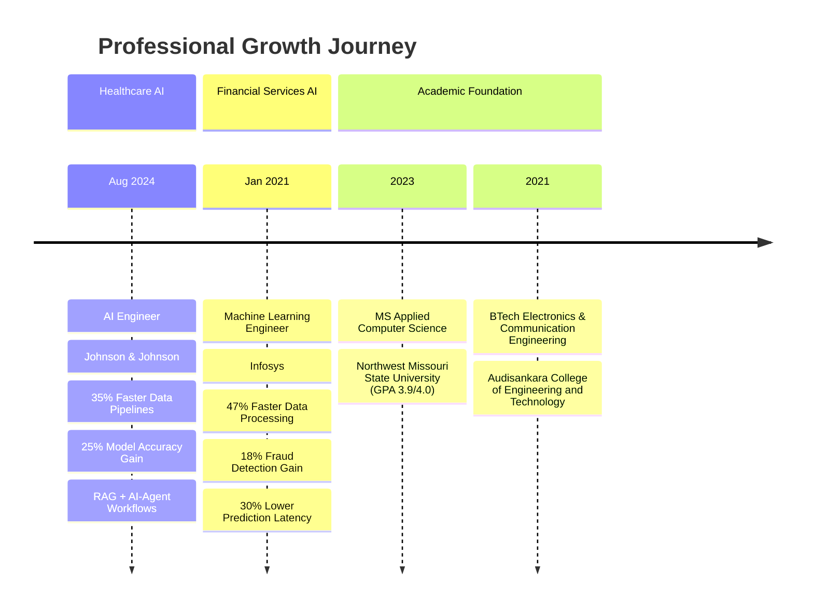
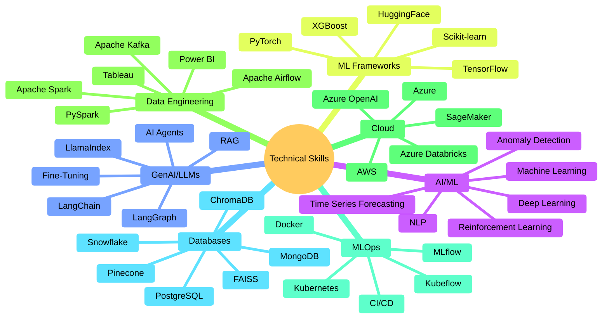

  

  ### 🤖 AI/ML Engineer | Healthcare & Financial Services AI Solutions

  
  [%20758--1287-25D366?style=for-the-badge&logo=whatsapp&logoColor=white)](tel:4087581287)
  
  

  *Authorized to work in the United States*

---

## 💼 PROFESSIONAL SUMMARY

**AI Engineer with 4+ years of experience** delivering end-to-end AI/ML solutions across **healthcare and financial services**. I translate business and clinical requirements into predictive models, fraud and credit-risk solutions, clinical decision-support systems, and patient outcome analytics.

I build and optimize healthcare and financial data pipelines, engineer features, and train and validate ML, deep learning, NLP, and transformer models. I also implement **RAG and AI-agent workflows** for unstructured data and knowledge retrieval — deploying models into production, establishing MLOps and monitoring practices, and driving measurable gains in processing efficiency, model accuracy, and operational decision-making.

---

## 📈 CAREER TIMELINE

```mermaid
timeline
    title Professional Growth Journey
    section Healthcare AI
    Aug 2024 : AI Engineer
             : Johnson & Johnson
             : 35% Faster Data Pipelines
             : 25% Model Accuracy Gain
             : RAG + AI-Agent Workflows
    section Financial Services AI
    Jan 2021 : Machine Learning Engineer
             : Infosys
             : 47% Faster Data Processing
             : 18% Fraud Detection Gain
             : 30% Lower Prediction Latency
    section Academic Foundation
    2023 : MS Applied Computer Science
         : Northwest Missouri State University (GPA 3.9/4.0)
    2021 : BTech Electronics & Communication Engineering
         : Audisankara College of Engineering and Technology
```

---

## 🏆 PROFESSIONAL EXPERIENCE

### 🏥 **AI Engineer — Johnson & Johnson** | USA | Aug 2024 – Present

- Translated clinical and business requirements into AI/ML use cases for **clinical decision support, disease-risk prediction, and patient outcome analysis**, partnering with healthcare and business stakeholders in Agile/Scrum teams
- Assessed and integrated structured and unstructured healthcare data, resolving data-quality issues to prepare reliable datasets for clinical analytics
- Re-engineered large-scale healthcare data pipelines using **Python, PySpark, and SQL**, reducing data processing time by **35%** and improving data availability for downstream analytics
- Built and evaluated machine learning and deep learning models for disease-risk prediction and clinical intelligence, improving model response accuracy by **25%**
- Applied **NLP and transformer-based models** to process unstructured clinical documents, extracting insights that support clinical decision-making
- Engineered **RAG-based information retrieval workflows** using LLMs and enterprise knowledge sources to deliver context-aware responses
- Implemented **AI-agent workflows** to automate document processing and repetitive clinical support activities, reducing manual intervention
- Deployed AI solutions as scalable production services with automated model delivery and lifecycle management
- Built dashboards for real-time model performance and data-quality monitoring, enabling proactive drift detection and supporting explainability, bias monitoring, and responsible AI governance

### 💳 **Machine Learning Engineer — Infosys** | India | Jan 2021 – Aug 2023

- Translated business requirements into ML solutions for **fraud prevention, credit risk assessment, customer intelligence, and financial forecasting**
- Integrated transaction, customer, account, and payment data into reliable datasets, cutting data processing time by **47%** through optimized Python, PySpark, and SQL pipelines
- Analyzed transaction behavior and historical outcomes to identify fraud patterns, risk indicators, and anomalies, guiding predictive feature selection
- Engineered behavioral and transaction-based features, improving fraud detection accuracy by **18%**
- Built and validated predictive models for fraud, credit risk, and forecasting based on accuracy, reliability, and business impact
- Designed real-time and batch scoring workflows helping risk teams prioritize higher-risk cases
- Deployed approved models to production on **AWS**, establishing secure, low-latency prediction services
- Established MLOps practices for model versioning, experiment tracking, and automated deployments
- Monitored production models for drift and performance changes, reducing prediction latency by **30%** while maintaining reliability
- Created **Tableau dashboards** and SQL reporting for fraud trends and model performance, giving stakeholders clear visibility into outcomes

---

## 💡 TECHNICAL SKILLS

```mermaid
%%{init: {'theme': 'base', 'themeVariables': { 'primaryTextColor': '#000000', 'secondaryTextColor': '#000000', 'tertiaryTextColor': '#000000'}}}%%
mindmap
  root((Technical Skills))
    AI/ML
      Machine Learning
      Deep Learning
      NLP
      Reinforcement Learning
      Time Series Forecasting
      Anomaly Detection
    GenAI/LLMs
      RAG
      Fine-Tuning
      AI Agents
      LangChain
      LangGraph
      LlamaIndex
    ML Frameworks
      PyTorch
      TensorFlow
      Scikit-learn
      XGBoost
      HuggingFace
    Data Engineering
      PySpark
      Apache Spark
      Apache Kafka
      Apache Airflow
      Power BI
      Tableau
    Cloud
      AWS
      Azure
      SageMaker
      Azure OpenAI
      Azure Databricks
    MLOps
      MLflow
      Kubeflow
      Docker
      Kubernetes
      CI/CD
    Databases
      PostgreSQL
      MongoDB
      Snowflake
      Pinecone
      ChromaDB
      FAISS
```

**Languages:** Python · SQL · R · Scala · Bash/Shell Scripting

**AI/ML:** Machine Learning · Deep Learning · NLP · Reinforcement Learning · Transfer Learning · Classification · Regression · Clustering · Recommendation Systems · Time Series Forecasting · Anomaly Detection · Feature Selection · Hyperparameter Tuning

**ML Frameworks:** PyTorch · TensorFlow · Keras · Scikit-learn · XGBoost · LightGBM · Hugging Face Transformers · OpenCV · spaCy · NLTK

**GenAI / LLMs:** LLMs · RAG · Fine-Tuning · Prompt Engineering · AI Agents · Agentic AI · Multi-Agent Systems · OpenAI API · Llama Models · LangChain · LlamaIndex · LangGraph · Embeddings · Semantic Search

**Data Engineering:** Pandas · NumPy · PySpark · Apache Spark · Apache Kafka · Apache Airflow · ETL/ELT · Data Modeling · Data Cleaning · Data Validation · Feature Engineering · Power BI · Tableau

**Cloud:** AWS · Microsoft Azure · Amazon SageMaker · Azure Machine Learning · Azure OpenAI · Azure Databricks · Azure Data Factory · Lambda · EC2 · S3 · Glue · Redshift

**MLOps / Deployment:** MLflow · Kubeflow · Docker · Kubernetes · CI/CD · GitHub Actions · Jenkins · GitLab · Model Monitoring · Experiment Tracking · Automated Retraining · FastAPI · Flask · REST APIs · Microservices

**Databases:** PostgreSQL · MySQL · SQL Server · Oracle · MongoDB · Snowflake · Redis · Elasticsearch · Pinecone · ChromaDB · FAISS

**Development / Agile:** Git · GitHub · VS Code · Linux/Unix · Postman · Agile · Scrum · Jira · Confluence · A/B Testing

**Security / Governance:** Data Privacy · Model Security · Bias Detection · Model Explainability · RBAC · HIPAA · GDPR · SOC 2 · Secure AI Deployment · AI Governance

---

## 🌟 FEATURED PROJECT

### 📊 **VisionStack: Business Growth Analytics Platform**

**Stack:** Python, PySpark, SQL, Databricks, Apache Spark, Git

- Built a scalable big data pipeline with **PySpark and Databricks**, processing millions of customer and product records from CSV, JSON, and Parquet sources into a unified analytics model
- Designed SQL ETL workflows with deduplication, normalization, and validation, generating KPIs for quarterly sales trends, product performance, and customer segmentation

🔗 **[View Project](https://github.com/kartikeya-datta/VisionStack)**

---

## 🎓 EDUCATION

- **Master of Science, Applied Computer Science** — Northwest Missouri State University, Maryville, MO · GPA 3.9/4.0
- **B.Tech, Electronics & Communication Engineering** — Audisankara College of Engineering and Technology, India

---

## 📫 LET'S CONNECT

I'm always interested in discussing **AI/ML engineering**, **GenAI and agentic systems**, **healthcare and financial AI applications**, or **career opportunities** in the AI space.

---

  

